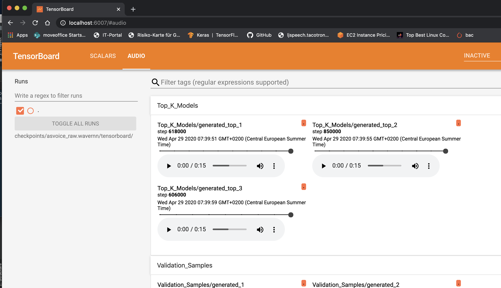

# ⏩ ForwardTacotron

Inspired by Microsoft's [FastSpeech](https://www.microsoft.com/en-us/research/blog/fastspeech-new-text-to-speech-model-improves-on-speed-accuracy-and-controllability/)
we modified Tacotron (Fork from fatchord's [WaveRNN](https://github.com/fatchord/WaveRNN)) to generate speech in a single forward pass using a duration predictor to align text and generated mel spectrograms. Hence, we call the model ForwardTacotron (see Figure 1).

<p align="center">
  
</p>
<p align="center">
  <b>Figure 1:</b> Model Architecture.
</p>

The model has following advantages:
- **Robustness:** No repeats and failed attention modes for challenging sentences.
- **Speed:** The generation of a mel spectogram takes about 0.04s on a GeForce RTX 2080.
- **Controllability:** It is possible to control the speed of the generated utterance.
- **Efficiency:** In contrast to FastSpeech and Tacotron, the model of ForwardTacotron
does not use any attention. Hence, the required memory grows linearly with text size, which makes it possible to synthesize large articles at once.


## UPDATE (08.07.2020)
Model is now compatible with the [MelGAN](https://github.com/seungwonpark/melgan) vocoder for faster-than-realtime synthesis on CPU.
Check out the [Colab Notebook](https://colab.research.google.com/github/as-ideas/ForwardTacotron/blob/master/notebooks/synthesize.ipynb) where you can synthesize text using a pretrained MelGAN or WaveRNN model trained on LJSpeech.

## 🔈 Samples

[Can be found here.](https://as-ideas.github.io/ForwardTacotron/)

The samples are generated with a model trained 100K steps on LJSpeech together with the pretrained WaveRNN vocoder
provided by the WaveRNN repo. Both models are commited in the pretrained folder. You can try them out with the following notebook:  

[](https://colab.research.google.com/github/as-ideas/ForwardTacotron/blob/master/notebooks/synthesize.ipynb)

## ⚙️ Installation

Make sure you have:

* Python >= 3.6

Install espeak as phonemizer backend (for macOS use brew):
```
sudo apt-get install espeak
```

Then install the rest with pip:
```
pip install -r requirements.txt
```

## 🚀 Training your own Model

(1) Download and preprocess the [LJSpeech](https://keithito.com/LJ-Speech-Dataset/) dataset:
 ```
python preprocess.py --path /path/to/ljspeech
```
(2) Train Tacotron with:
```
python train_tacotron.py
```
(3) Use the trained tacotron model to create alignment features with:
```
python train_tacotron.py --force_align
```
(4) Train ForwardTacotron with:
```
python train_forward.py
```
(5) Generate Sentences with Griffin-Lim vocoder:
```
python gen_forward.py --alpha 1 --input_text "this is whatever you want it to be" griffinlim
```
If you want to use the [MelGAN](https://github.com/seungwonpark/melgan) vocoder, you can produce .mel files with:
```
python gen_forward.py --input_text 'this is whatever you want it to be' melgan
```
To vocode the resulting .mel files use the inference.py script from the MelGAN repo and point to the model output folder (see inference example at [MelGAN](https://github.com/seungwonpark/melgan))
```

As in the original repo you can also use a trained WaveRNN vocoder:
```
python gen_forward.py --input_text 'this is whatever you want it to be' wavernn
```

For training the model on your own dataset just bring it to the LJSpeech-like format:
```
|- dataset_folder/
|   |- metadata.csv
|   |- wav/
|       |- file1.wav
|       |- ...
```

For languages other than English, change the language and cleaners params in the hparams.py, e.g. for French:
```
language = 'fr'
tts_cleaner_name = 'basic_cleaners'
```

____
You can monitor the training processes for Tacotron and ForwardTacotron with 
```
tensorboard --logdir checkpoints
```
Here is what the ForwardTacotron tensorboard looks like:
<p align="center">
  
</p>
<p align="center">
  <b>Figure 2:</b> Tensorboard example for training a ForwardTacotron model.
</p>


## Use the pretrained Models

You can synthesize text using the pretrained models with
```
python gen_forward.py --input_text 'Hi there!' --hp_file pretrained/pretrained_hparams.py --tts_weights pretrained/forward_400K.pyt' wavernn --voc_weights pretrained/wave_575K.pyt

```

## Tips for training a WaveRNN model

- From experience I recommend starting with the standard params (RAW mode with 9 bit), which
should start to sound good after about 300k steps.
- Sound quality of the models varies quite a bit, so it is important to cherry-pick the best one.
- For cherry-picking it is useful to listen to the validation sound samples in tensorboard. 
The sound quality of the samples is measured by an additional metric (L1 distance of mel specs).
- The top k models according to the above metric are constantly monitored and checkpointed under path/to/checkpoint/top_k_models.

Here is what the WaveRNN tensorboard looks like:
<p align="center">
  
</p>
<p align="center">
  <b>Figure 3:</b> Tensorboard example for training a WaveRNN model.
</p>


## References

* [FastSpeech: Fast, Robust and Controllable Text to Speech](https://arxiv.org/abs/1905.09263)

## Acknowlegements

* [https://github.com/keithito/tacotron](https://github.com/keithito/tacotron)
* [https://github.com/fatchord/WaveRNN](https://github.com/fatchord/WaveRNN)
* [https://github.com/xcmyz/LightSpeech](https://github.com/xcmyz/LightSpeech)

## Maintainers

* Christian Schäfer, github: [cschaefer26](https://github.com/cschaefer26)

## Copyright

See [LICENSE](LICENSE) for details.
